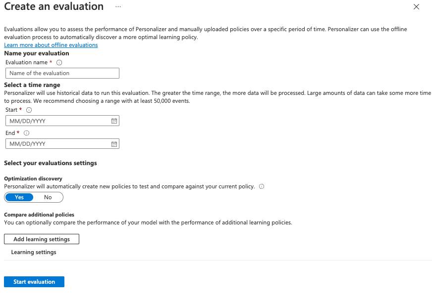

---
lab:
  title: Usar o Personalizador de IA com Notebooks do Visual Studio Code para simular um loop
---
> **Importante**: a partir do outono de 2023, não será mais possível criar novos recursos do Personalizador.

> **Observação**: para concluir este exercício, você precisará de uma [assinatura do Azure](https://azure.microsoft.com/free?azure-portal=true).

Neste exercício, você usará o Personalizador de IA do Azure com notebooks no Visual Studio Code para simular um loop de aprendizado.

## Criar um recurso do Personalizador de IA do Azure usando o portal do Azure

1. No portal do Azure, pesquise por **serviços de IA do Azure**. Em seguida, selecione **Criar** em **Personalizador** na lista de resultados.

   

1. Selecione sua assinatura, insira um nome para o grupo de recursos e um nome para o seu recurso. Para o tipo de preço, escolha **F0 Gratuito**.
1. Selecione **Revisar + criar** para rever as suas escolhas e, em seguida, selecione **Criar** para criar seu recurso.
1. Acesse o recurso do Personalizador de IA do Azure recém-criado e, no painel Chaves e Ponto de Extremidade, copie e cole a **Chave** e o **Ponto de Extremidade** em um lugar seguro para usar depois:

   

1. Selecione Configuração no painel de navegação e, em seguida, defina o **Tempo de espera da recompensa** para **10 minutos** (se já não estiver definido) e defina a **Frequência de atualização do modelo** para **15 segundos**.
1. Selecione **Salvar**.

## Configurar o notebook

1. No editor Visual Studio Code, pressione **Ctrl+Shift+P** e selecione **Criar: Novo Jupyter Notebook**.
1. Salve o arquivo e nomeie-o como **my-notebook** em seu dispositivo.
1. Agora você precisa instalar as extensões necessárias. No canto superior direito do notebook, escolha **Selecionar Kernel**. Em seguida, selecione **Instalar/Habilitar extensões sugeridas**.

   

   > [!NOTE]
   > Se você já fez isso antes, não verá essa opção e poderá pular esta etapa.

1. Aguarde até que as extensões sejam instaladas e selecione **Ambientes Python...** na lista de seleção exibida.
1. Em seguida, selecione o ambiente mais recomendado.

## Preparar dados

Para que possamos realizar este exercício, criaremos uma lista de usuários e uma lista de produtos de café que podemos usar como dados de base para nosso Personalizador de IA do Azure.

1. Copie o código JSON a seguir em um arquivo vazio e salve-o como `users.json` na mesma pasta que o arquivo do notebook.

   ```json
   {
     "Alice": {
       "Sunny": {
         "Morning": "Cold brew",
         "Afternoon": "Iced mocha",
         "Evening": "Cold brew"
       },
       "Rainy": {
         "Morning": "Latte",
         "Afternoon": "Cappucino",
         "Evening": "Latte"
       },
       "Snowy": {
         "Morning": "Cappucino",
         "Afternoon": "Cappucino",
         "Evening": "Cappucino"
       }
     },
     "Bob": {
       "Sunny": {
         "Morning": "Cappucino",
         "Afternoon": "Iced mocha",
         "Evening": "Cold brew"
       },
       "Rainy": {
         "Morning": "Latte",
         "Afternoon": "Latte",
         "Evening": "Latte"
       },
       "Snowy": {
         "Morning": "Iced mocha",
         "Afternoon": "Iced mocha",
         "Evening": "Iced mocha"
       }
     },
     "Cathy": {
       "Sunny": {
         "Morning": "Latte",
         "Afternoon": "Cold brew",
         "Evening": "Cappucino"
       },
       "Rainy": {
         "Morning": "Cappucino",
         "Afternoon": "Latte",
         "Evening": "Iced mocha"
       },
       "Snowy": {
         "Morning": "Cold brew",
         "Afternoon": "Iced mocha",
         "Evening": "Cappucino"
       }
     },
     "Dave": {
       "Sunny": {
         "Morning": "Iced mocha",
         "Afternoon": "Iced mocha",
         "Evening": "Iced mocha"
       },
       "Rainy": {
         "Morning": "Latte",
         "Afternoon": "Latte",
         "Evening": "Latte"
       },
       "Snowy": {
         "Morning": "Cappucino",
         "Afternoon": "Cappucino",
         "Evening": "Cappucino"
       }
     }
   }
   ```

1. Em seguida, copie código a seguir e salve-o em um arquivo chamado `coffee.json`:

   ```json
   [
     {
       "id": "Cappucino",
       "features": [
         {
           "type": "hot",
           "origin": "kenya",
           "organic": "yes",
           "roast": "dark"
         }
       ]
     },
     {
       "id": "Cold brew",
       "features": [
         {
           "type": "cold",
           "origin": "brazil",
           "organic": "yes",
           "roast": "light"
         }
       ]
     },
     {
       "id": "Iced mocha",
       "features": [
         {
           "type": "cold",
           "origin": "ethiopia",
           "organic": "no",
           "roast": "light"
         }
       ]
     },
     {
       "id": "Latte",
       "features": [
         {
           "type": "hot",
           "origin": "brazil",
           "organic": "no",
           "roast": "dark"
         }
       ]
     }
   ]
   ```

1. Copie e cole o código a seguir em um arquivo e salve-o como `example-rankrequest.json`:

   ```json
   {
     "contextFeatures": [],
     "actions": [],
     "excludedActions": [],
     "eventId": "",
     "deferActivation": false
   }
   ```

## Definir o ponto de extremidade e a chave

1. Na parte superior do notebook, adicione código a seguir para incluir os módulos necessários:

   ```python
   import json
   import matplotlib.pyplot as plt
   import random
   import requests
   import time
   import uuid
   import datetime
   ```

1. Selecione a célula e, em seguida, selecione o botão de execução à esquerda da célula:

   

   > [!NOTE]
   > Selecione o botão de execução sempre que você preencher uma nova célula. Se você for solicitado a instalar o pacote ipykernel, selecione **Instalar**.

1. Selecione **+ Código** na parte superior do notebook para criar uma nova célula de código. Em seguida, adicione o seguinte código:

   ```python
   # Replace 'personalization_base_url' and 'resource_key' with your valid endpoint values.
   personalization_base_url = "<your-endpoint>"
   resource_key = "<your-resource-key>"
   ```

1. Substitua o valor de **personalization_base_url** pelo ponto de extremidade que você copiou e valor de **resource_key** pela chave.

## Acompanhar iterações

1. Em seguida, você cria o código ajuda a tomar nota dos horários de início e fim das funções iterativas que você usará posteriormente. Adicione o código a seguir em uma nova célula:

   ```python
   # Print out current datetime
   def currentDateTime():
       currentDT = datetime.datetime.now()
       print (str(currentDT))

   # ititialize variable for model's last modified date
   modelLastModified = ""

   def get_last_updated(currentModifiedDate):

       print('-----checking model')

       # get model properties
       response = requests.get(personalization_model_properties_url, headers = headers, params = None)

       print(response)
       print(response.json())

       # get lastModifiedTime
       lastModifiedTime = json.dumps(response.json()["lastModifiedTime"])

       if (currentModifiedDate != lastModifiedTime):
           currentModifiedDate = lastModifiedTime
           print(f'-----model updated: {lastModifiedTime}')
   ```

1. Não se esqueça de executar sua nova célula depois de adicionar o novo código.

## Obter política e configuração do serviço

1. Em seguida, você precisará validar o estado do serviço obtendo a política e a configuração do serviço. Para fazer isso, adicione o código a seguir a uma nova célula:

   ```python
   def get_service_settings():

       print('-----checking service settings')

       # get learning policy
       response = requests.get(personalization_model_policy_url, headers = headers, params = None)

       print(response)
       print(response.json())

       # get service settings
       response = requests.get(personalization_service_configuration_url, headers = headers, params = None)

       print(response)
       print(response.json())
   ```

1. Execute sua nova célula de código.

O código consiste em uma função que faz duas chamadas para a API de serviço. Ao chamar a função, ela retorna os valores de serviço usando a resposta.

## Configurar URLs para chamadas e ler arquivos JSON

Agora você adicionará código para:

- compilar as URLs usadas em chamadas REST
- definir o cabeçalho de segurança usando a chave do seu recurso Personalizador
- definir a semente aleatória para a ID do evento de Classificação
- ler os arquivos de dados JSON
- chamar o método get_last_updated — a política de aprendizado foi removida na saída do exemplo
- chamar o método get_service_settings

1. Para fazer isso, adicione o código a seguir a uma nova célula e execute-o:

   ```python
   # build URLs
   personalization_rank_url = personalization_base_url + "personalizer/v1.0/rank"
   personalization_reward_url = personalization_base_url + "personalizer/v1.0/events/" #add "{eventId}/reward"
   personalization_model_properties_url = personalization_base_url + "personalizer/v1.0/model/properties"
   personalization_model_policy_url = personalization_base_url + "personalizer/v1.0/configurations/policy"
   personalization_service_configuration_url = personalization_base_url + "personalizer/v1.0/configurations/service"

   headers = {'Ocp-Apim-Subscription-Key' : resource_key, 'Content-Type': 'application/json'}

   # context
   users = "users.json"

   # action features
   coffee = "coffee.json"

   # empty JSON for Rank request
   requestpath = "example-rankrequest.json"

   # initialize random
   random.seed(time.time())

   userpref = None
   rankactionsjsonobj = None
   actionfeaturesobj = None

   with open(users) as handle:
       userpref = json.loads(handle.read())

   with open(coffee) as handle:
       actionfeaturesobj = json.loads(handle.read())

   with open(requestpath) as handle:
       rankactionsjsonobj = json.loads(handle.read())

   get_last_updated(modelLastModified)
   get_service_settings()

   print(f'User count {len(userpref)}')
   print(f'Coffee count {len(actionfeaturesobj)}')
   ```

1. A chamada deve retornar uma resposta parecida com a seguinte:

   ```bash
   -----checking model
   <Response [200]>
   {'creationTime': '2023-09-22T14:58:45+00:00', 'lastModifiedTime': '2023-09-22T14:58:45+00:00'}
   -----model updated: "2023-09-22T14:58:45+00:00"
   -----checking service settings
   <Response [200]>
   {'name': '917554355a3347a1af3d2935d521426a', 'arguments': '--cb_explore_adf --epsilon 0.20000000298023224 --power_t 0 -l 0.001 --cb_type mtr -q ::'}
   <Response [200]>
   {'rewardWaitTime': 'PT10M', 'defaultReward': 0.0, 'rewardAggregation': 'earliest', 'explorationPercentage': 0.2, 'modelExportFrequency': 'PT15S', 'logRetentionDays': 90, 'lastConfigurationEditDate': '2021-01-01T00:00:00', 'learningMode': 'Online'}
   User count 4
   Coffee count 4
   ```

1. O código de resposta deve indicar `<Response [200]>` para indicar uma chamada bem-sucedida. O **rewardWaitTime** deve aparecer como 10 minutos e **modelExportFrequency** deve ser de 15 segundos.

## Configurar um gráfico no portal do Azure

Seu código faz solicitações à API. Para obter uma boa métrica das suas solicitações, você pode criar um gráfico de métricas no portal do Azure:

1. No portal do Azure, acesse o recurso Personalizador de IA do Azure.

1. No painel de navegação, selecione as **Métricas** em Monitoramento.

   

1. Os namespaces **Escopo** e **Métrica** já estão definidos para você. Você só precisa selecionar a **Métrica** de **Chamadas bem-sucedidas** e a **Agregação** de **Soma**.

1. Altere o filtro de tempo para as últimas quatro horas.

## Criar IDs de evento exclusivas

Em seguida, você adiciona código para gerar uma ID exclusiva para cada chamada à API de classificação. Use essa ID para identificar as informações de classificação e de chamada de recompensas para as solicitações.

1. Para fazer isso, crie uma nova célula de código em seu notebook e adicione o seguinte:

   ```python
   def add_event_id(rankjsonobj):
       eventid = uuid.uuid4().hex
       rankjsonobj["eventId"] = eventid
       return eventid
   ```

1. Lembre-se de executar sua nova célula de código.

> [!NOTE]
> Em um cenário real, você configuraria isso para algo parecido com a ID da transação de uma compra.

## Obter um usuário, a hora do dia e o clima

Agora você pode adicionar uma função para:

- Selecionar um combinação exclusiva de usuário, hora do dia e clima.
- Adicionar esses itens selecionados a um objeto JSON que será enviado à API de Classificação por meio de uma chamada.

Para fazer isso, adicione o código a seguir a uma nova célula e execute-o:

```python
def add_random_user_and_contextfeatures(namesoption, weatheropt, timeofdayopt, rankjsonobj):
    name = namesoption[random.randint(0,3)]
    weather = weatheropt[random.randint(0,2)]
    timeofday = timeofdayopt[random.randint(0,2)]
    rankjsonobj['contextFeatures'] = [{'timeofday': timeofday, 'weather': weather, 'name': name}]
    return [name, weather, timeofday]
```

## Adicionar os dados de café

Em seguida, você cria uma função para adicionar toda a lista de produtos de café em um objeto JSON que você envia para a API de Classificação.

Para fazer isso, adicione código a seguir a uma nova célula e execute-o:

```python
def add_action_features(rankjsonobj):
    rankjsonobj["actions"] = actionfeaturesobj
```

## Comparar as previsões com as preferências conhecidas dos usuários

Você pode então criar uma função para comparar a preferência de um usuário por um café específico, levando em consideração informações como clima e hora do dia, que são sugeridas pelo Personalizador de IA do Azure.

1. Para fazer isso, crie uma nova célula, adicione o código a seguir e execute-o:

   ```python
   def get_reward_from_simulated_data(name, weather, timeofday, prediction):
       if(userpref[name][weather][timeofday] == str(prediction)):
           return 1
       return 0
   ```

1. Essa função deve ser executada sempre que a API de Classificação for chamada. Se a sugestão corresponder, uma pontuação de `1` será retornada na resposta. Se não corresponder, então `0` será retornada.

## Criar um loop com chamadas para as APIs de Classificação e Recompensa

As células anteriores são usadas para configurar o notebook para realizar o loop. Agora você configurará o loop. O loop abrange o corpo principal do trabalho em seu notebook. Obtém um usuário aleatório, obtém a lista de cafés e envia ambos para a API de Classificação. Também compara a previsão do Personalizador de IA do Azure com as preferências conhecidas desse usuário e envia a recompensa de volta para o Personalizador de IA do Azure.

Para criar seu loop, adicione código a seguir a uma nova célula e execute-o:

```python
def iterations(n, modelCheck, jsonFormat):

    i = 1

    # default reward value - assumes failed prediction
    reward = 0

    # Print out dateTime
    currentDateTime()

    # collect results to aggregate in graph
    total = 0
    rewards = []
    count = []

    # default list of user, weather, time of day
    namesopt = ['Alice', 'Bob', 'Cathy', 'Dave']
    weatheropt = ['Sunny', 'Rainy', 'Snowy']
    timeofdayopt = ['Morning', 'Afternoon', 'Evening']


    while(i <= n):

        # create unique id to associate with an event
        eventid = add_event_id(jsonFormat)

        # generate a random sample
        [name, weather, timeofday] = add_random_user_and_contextfeatures(namesopt, weatheropt, timeofdayopt, jsonFormat)

        # add action features to rank
        add_action_features(jsonFormat)

        # show JSON to send to Rank
        print('To: ', jsonFormat)

        # choose an action - get prediction from Personalizer
        response = requests.post(personalization_rank_url, headers = headers, params = None, json = jsonFormat)

        # show Rank prediction
        print ('From: ',response.json())

        # compare personalization service recommendation with the simulated data to generate a reward value
        prediction = json.dumps(response.json()["rewardActionId"]).replace('"','')
        reward = get_reward_from_simulated_data(name, weather, timeofday, prediction)*10

        # show result for iteration
        print(f'   {i} {currentDateTime()} {name} {weather} {timeofday} {prediction} {reward}')

        # send the reward to the service
        response = requests.post(personalization_reward_url + eventid + "/reward", headers = headers, params= None, json = { "value" : reward })

        # for every N rank requests, compute total correct  total
        total =  total + reward

        # every N iteration, get last updated model date and time
        if(i % modelCheck == 0):

            print("**** 10% of loop found")

            get_last_updated(modelLastModified)

        # aggregate so chart is easier to read
        if(i % 10 == 0):
            rewards.append( total)
            count.append(i)
            total = 0

        i = i + 1

    # Print out dateTime
    currentDateTime()

    return [count, rewards]
```

Aqui está um exemplo da estrutura JSON que a função envia para a API de Classificação:

```python
{
    'contextFeatures':[
      {
          'timeofday':'Evening',
          'weather':'Snowy',
          'name':'Alice'
      }
    ],
    'actions':[
      {
          'id':'Cappucino',
          'features':[
            {
                'type':'hot',
                'origin':'kenya',
                'organic':'yes',
                'roast':'dark'
            }
          ]
      }
        ...rest of the coffee list
    ],
    'excludedActions':[

    ],
    'eventId':'b5c4ef3e8c434f358382b04be8963f62',
    'deferActivation':False
}
```

A API de Classificação responderá com uma resposta estruturada assim:

```python
{
    'ranking': [
        {'id': 'Latte', 'probability': 0.85 },
        {'id': 'Iced mocha', 'probability': 0.05 },
        {'id': 'Cappucino', 'probability': 0.05 },
        {'id': 'Cold brew', 'probability': 0.05 }
    ],
    'eventId': '5001bcfe3bb542a1a238e6d18d57f2d2',
    'rewardActionId': 'Latte'
}
```

Cada iteração do loop exibirá o usuário, o clima e a hora do dia selecionados aleatoriamente, além da recompensa determinada adequadamente:

```bash
1 Alice Rainy Morning Latte 1
```

Uma recompensa de `1` significa que seu recurso Personalizador de IA do Azure selecionou o tipo de café correto para essa combinação específica de usuário, clima e hora do dia.

## Executar o loop e visualizar os resultados do gráfico

O Personalizador de IA do Azure precisa de alguns milhares de chamadas à API de Classificação e à API de Recompensa para criar um modelo. Você executará seu loop por um número definido de iterações.

1. Para fazer isso, crie uma nova célula de código, adicione o código a seguir e execute-o:

   ```python
   # max iterations
   num_requests = 150

   # check last mod date N% of time - currently 10%
   lastModCheck = int(num_requests * .10)

   jsonTemplate = rankactionsjsonobj

   # main iterations
   [count, rewards] = iterations(num_requests, lastModCheck, jsonTemplate)
   ```

1. Atualize o gráfico de métricas no portal do Azure de vez em quando para ver o total de chamadas ao serviço.
1. Este evento pode demorar um pouco. Não feche seu notebook até terminar. Quando o loop realizar cerca de 20.000 chamadas (uma chamada de classificação e recompensa para cada iteração do loop), o loop terminará.

1. A seguida, você criará um gráfico em seu notebook para plotar os lotes de eventos de classificação e quantas recomendações corretas foram feitas para cada lote. Para fazer isso, adicione o código a seguir em uma nova célula e execute-o:

   ```python
   def createChart(x, y):
       plt.plot(x, y)
       plt.xlabel("Batch of rank events")
       plt.ylabel("Correct recommendations per batch")
       plt.show()

   createChart(count,rewards)
   ```

1. Seu notebook criará um gráfico:

   

> **Dica:** Em condições ideais, depois que o teste terminar, seu loop deverá, em média, fazer recomendações corretas a uma taxa de 100% menos o valor de exploração (que é 20% por padrão), então 80% é sua taxa-alvo aqui. Uma maneira de chegar a isso é aumentar as iterações para pelo menos 10.000.

O gráfico exibe quão bem-sucedido é seu modelo com base na política de aprendizado padrão. Este gráfico mostra que a política de aprendizado pode ser melhorada. Você pode fazer isso alterando a política após a execução das avaliações.

## Executar uma avaliação offline

> [!NOTE]
> Neste exercício, esta seção é opcional porque ela só pode ser realizada depois de ter feito pelo menos 50.000 chamadas para o recurso do Personalizador de IA do Azure. Mas você poderá voltar para esta seção se, em algum momento, atingir 50.000 chamadas em seu recurso.

Você pode executar uma avaliação offline para encontrar uma política de aprendizado melhor para um recurso do Personalizador de IA do Azure com pelo menos 50.000 chamadas.

1. No portal do Azure, acesse o painel Otimizar do recurso Personalizador de IA do Azure e selecione **Criar avaliação**.
1. Forneça um nome para a avaliação e selecione um intervalo de datas de início e fim para a avaliação do seu loop. O intervalo de datas deve incluir apenas os dias em que você está focando para sua avaliação:

   

1. Selecione **Iniciar avaliação** para começar.

1. Quando sua avaliação terminar, selecione-a na lista de avaliações do painel Otimizar. Em seguida, analise o desempenho das suas políticas de aprendizado com base em detalhes como recompensa média, intervalos de confiança e muito mais:

   

1. Você verá algumas políticas, incluindo:

   - **Online** – a política atual do Personalizador de IA do Azure.
   - **Baseline1** – a política de linha de base do aplicativo
   - **BaselineRand** – uma política de executar ações aleatoriamente.
   - **Inter-len#** ou **Hyper#** – políticas criadas pela Descoberta de otimização.

1. Selecione **Aplicar** na política que melhora o modelo.

## Limpar os recursos

Se você não estiver usando os recursos do Azure criados neste laboratório para outros módulos de treinamento, poderá excluí-los para evitar incorrer em cobranças adicionais.

1. Abra o portal do Azure em `https://portal.azure.com`,e na barra de pesquisa superior, procure os recursos criados neste laboratório.

2. Na página de recursos, selecione **Excluir** e siga as instruções para excluir o recurso. Como alternativa, você pode excluir todo o grupo de recursos para limpar todos os recursos ao mesmo tempo.
